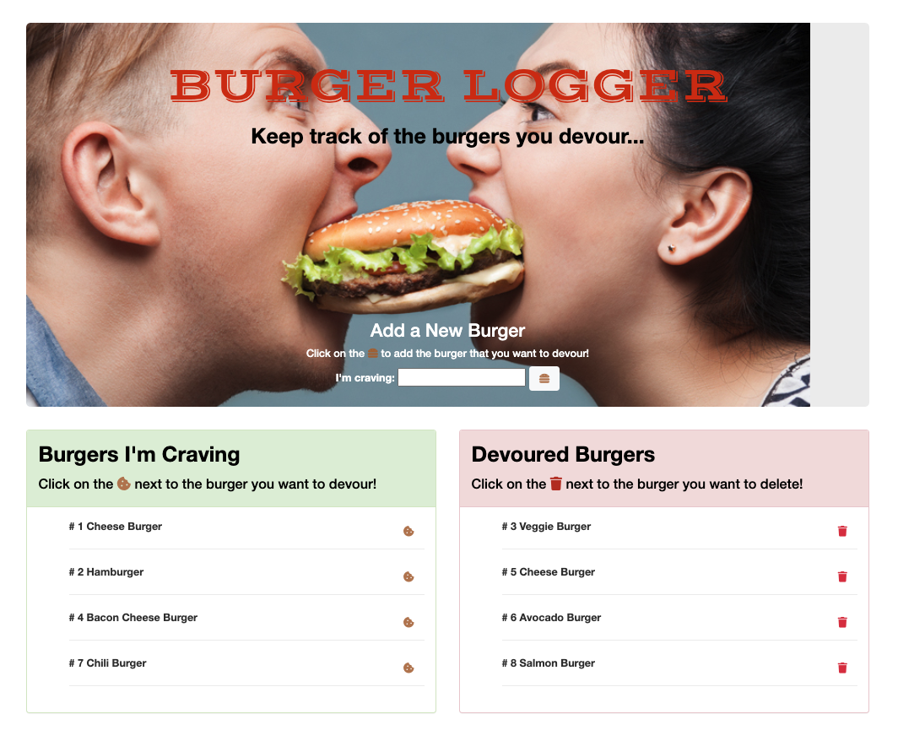

# Burger_Logger

## Description

Burger Logger is a restaurant app that lets users input the names of burgers they'd like to eat. Whenever a user submits a burger's name, the app will display the burger on the bottom left side of the page -- waiting to be devoured. Each burger in the waiting area also has a Devour it button. When the user clicks it, the burger will move to the bottom right side of the page. The app will store every 🍔  in a database (mySQL), whether devoured or not.

 

## Table of Contents

- [Description](#Description)
- [Technologies](#technologies)
- [Preview](#preview)
- [Questions](#questions)

 

## Technologies

| Frontend  | Backend |
| ------------- | ------------- |
| HTML | Nodejs |
| CSS  | Express |
| Javascript / jQuery | JawsDB|
| Bootstrap | Heroku|
|Handlebars |

 

## Preview

 

## Questions

If you have any questions, contact SIROG-E at goris.evelyn@gmail.com

 

## Repository

- [Project Repo](https://github.com/SIROG-E/Burger_Logger)

- [Deployed Heroku](https://burger-logger-eg.herokuapp.com/)

 

## GitHub

- Evelyn Goris
- [GitHub Profile](https://github.com/SIROG-E)
- <goris.evelyn@gmail.com>
